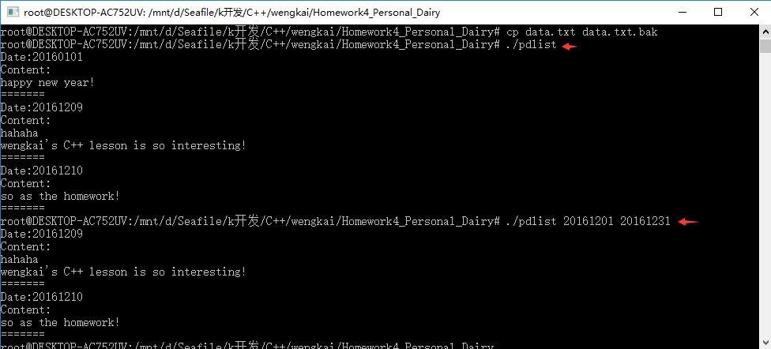
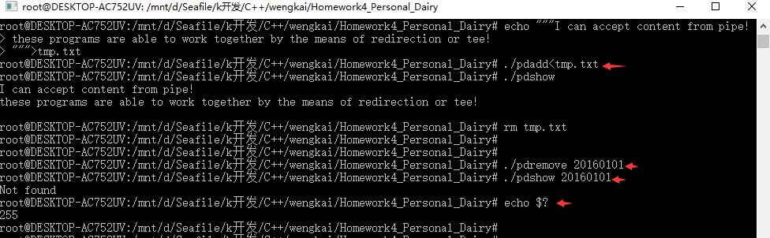

# Homework4 Personal Dairy


## 题目描述 Description

The Personal Diary is a CLI (Command Line Interface) software, consists of three programs:

```
pdadd 
pdlist [ ]
pdshow 
pdremove 
```

pdadd is used to add an entity into the diary for the date. If an entity of the same date is in the diary, the existing one will be replaced. pdadd reads lines of the diary from the stdin, line by line, until a line with single '.' character or the EOF character (Ctrl-D in Unix and Ctrl- Z in Windows).

pdlist lists all entities in the diary ordered by date. If start and end date are provided through command line parameters, it lists entities between start and end only. This program lists to the stdout.

pdshow prints the content of the entity specified by the date to the stdout. 

pdremove removes one entity of the date. It returns 0 at success and -1 at failure.

The software stores diary in one data file, reads to the memory at begining of each program and stores back to the file at the end of process.

Common classes and functions should be shared between programs. No interactive is permitted, so these programs are able to work together by the means of redirection or tee, are able to be used in a shell script.

====

## 类的说明 Class Description

Diary.h 提供Diary这个类，公开以下接口：

```
static int today(); //返回今天的日期，返回类型int，如20161210

Dairy(string filename); //构造函数，需要传入一个存储的文件名，如"data.txt"，文件可以不存在

virtual ~Dairy(); //析构函数，将数据写入到同一个文件

void pdadd(int date,string& content); //传入日期与日记内容，在内存中存储之

void pdlist(int begin=0,int end=99999999,bool friendly=true); //显示从begin到end之间所有的日记，如果传入friendly=False则按照和文件存储方式同样的形式输出（析构函数无法写入文件时会这样调用以防止数据丢失）

string pdshow(int date=today());//显示给定日期的日记

int pdremove(int date);//删除给定日期的日记
```

使用这个类的有4个cpp文件，都是这个类的简单调用来完成用户交互

====

# 测试代码 Test

```bash
make clean
make

cp data.txt data.txt.bak
./pdlist
./pdlist 20161201 20161231

echo """I can accept content from pipe!
these programs are able to work together by the means of redirection or tee!
""">tmp.txt
./pdadd<tmp.txt
./pdshow
rm tmp.txt

./pdremove 20160101
./pdshow 20160101
echo $? #this will output 255, which means -1 is returned by the program

rm data.txt
mv data.txt.bak data.txt
```

Here is the screenshot of these test code:



